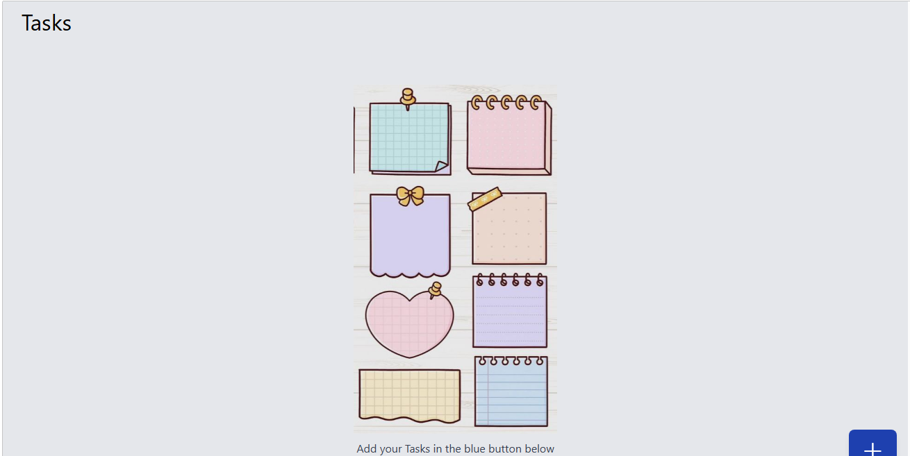

## ✅ MyProjectName
This project is name is called Daily Done.

# Portolio 



# Summary
A clean, modern task management application built with Vue.js and Tailwind CSS. Features an intuitive interface for organizing daily tasks with priority levels and flexible scheduling options.

# ✨ Features
The task manager includes the following powerful and user-friendly features:
📝 Task Creation & Management
Create, edit, and delete tasks with a simple, intuitive interface
📅 Flexible Scheduling
Choose from preset options (Today, Tomorrow) or select custom dates for any task
🎯 Priority System
Organize tasks with High, Medium, and Low priority levels with visual color coding
✏️ Edit Functionality
Modify existing tasks including text, dates, and priority levels seamlessly
💾 Local Storage
Automatically saves all tasks locally - your data persists even after page refreshes
📱 Fully Responsive Design
Optimized layout that works perfectly on mobile, tablet, and desktop screens
🎨 Modern UI/UX
Clean glassmorphism design with smooth animations and hover effects


## 🛠️ Technologies Used
| Category        | Technologies                          |
|-----------------|---------------------------------------|
| 🖥️ Frontend     | Vue 3, Tailwind CSS, Hero Icons       |
| 🎨 Styling      | Tailwind CSS, AOS                     |
| 🚀 Build Tools  | 	Vite                                 |
| 🧠 State Mgm    | VueUse                                | 
| 💾 Data Storage | Local Storage API                     | 
| 🌍 Deployment   | Vercel                                |

## 🚀 Installation

1. Clone the repository:
   ```bash
   git clone https://github.com/yourusername/project-dashboard.git

## 🤝 Contributing
Contributions are welcome!  
Please fork the repo and create a pull request.
1. Fork the Project  
2. Create your Feature Branch (`git checkout -b feature/AmazingFeature`)  
3. Commit your Changes (`git commit -m 'Add some AmazingFeature'`)  
4. Push to the Branch (`git push origin feature/AmazingFeature`)  
5. Open a Pull Request


## 📬 Contact
Made by @Ifedollars99
**Hamzah Taofeeq ifedolapo**  
📧 taofeeqifedollar@gmail.com  
🔗 [LinkedIn](https://www.linkedin.com/in/taofeeq-ifedolapo-7890162ba?utm_source=share&utm_campaign=share_via&utm_content=profile&utm_medium=android_app) 
| [Twitter](https://x.com/IfedollarsAvr?t=KWrkgQdZLuh7Y7xaCLCWeg&s=09)
# Ghost of the System 👻

